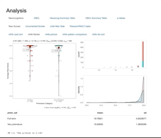

# Interactive HTML page with tabs that show 

This is an interactive HTML page I made using R Markdown for an analysis examining the relationship between prematurity, mental health, and neurocognition. Several tabs are nested in other tabs for each analysis. Every analysis has an associated violin plot, a histogram, and a density plot. Below the graphs are a table with means and SDs, as well as a p-value at the bottom.

This was sort of quickly hacked together. I realize now a better way to do this would probably be to make a Shiny App instead.

